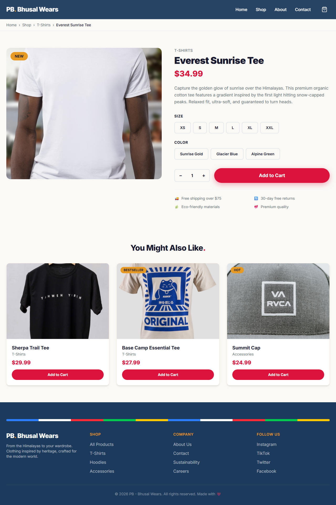
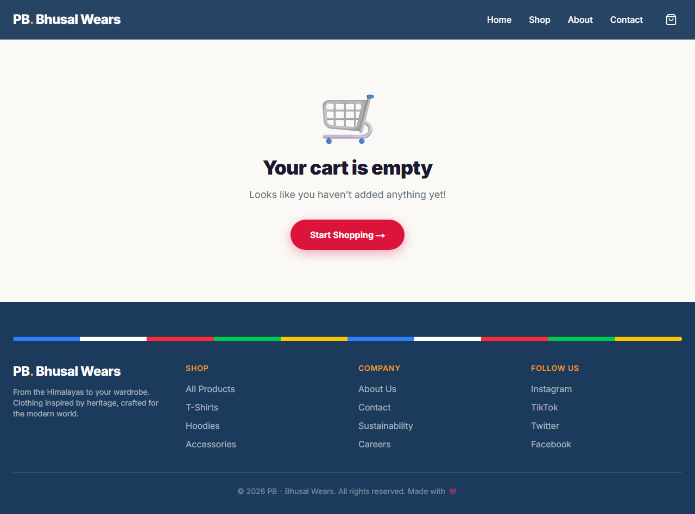

# PB. Bhusal Wears 🏔️

A heritage-inspired clothing brand website built with **Next.js 16**, **React 19**, **TypeScript**, and **Tailwind CSS 4**. Features a full shopping experience with product catalog, detail pages, shopping cart, and automated deployment.


🌐 **Live Site:** [pratikbhusal18.github.io/pb-bhusal-wears](https://pratikbhusal18.github.io/pb-bhusal-wears/)

---

## Screenshots

### 🏠 Home Page
Mountain-themed hero with prayer flag decorations, featured products, testimonials, and newsletter signup.


### 🛍️ Shop Page
16 products with real photography, interactive category filters, and Add to Cart buttons.


### 📄 Product Detail Page
Full product view with size/color selectors, quantity picker, and "You Might Also Like" section.



### 🛒 Shopping Cart
Cart with product images, quantity controls, order summary, and free shipping calculator.



### 📖 About Page
Brand story, company timeline, core values, and team section.


### 💬 Contact Page
Contact form with validation, business details, and interactive FAQ accordion.


### 📱 Mobile View
Fully responsive design with hamburger navigation and stacked layouts.

<p align="center">
  
</p>

---

## Overview

PB - Bhusal Wears is an e-commerce storefront for a heritage-inspired clothing brand. The Himalayan-themed design features crimson, saffron gold, and deep blue tones with mountain motifs throughout. Built with a modern React architecture, ready to scale into a full-stack application.

### Pages

| Page | Route | Description |
|------|-------|-------------|
| **Home** | `/` | Mountain hero, prayer flags, featured products, testimonials, newsletter |
| **Shop** | `/shop` | 16 products with category filtering and real photography |
| **Product Detail** | `/shop/[id]` | Size/color selector, quantity picker, related products |
| **Cart** | `/cart` | Item management, quantity controls, order summary |
| **About** | `/about` | Brand story, timeline, values, team |
| **Contact** | `/contact` | Contact form, business info, FAQ accordion |

### Product Catalog (16 items)

| Category | Products |
|----------|----------|
| **T-Shirts** | Everest Sunrise Tee, Sherpa Trail Tee, Base Camp Essential Tee, Khumbu Thermal Henley |
| **Hoodies** | Annapurna Color Block Hoodie, Yeti Oversized Hoodie, Prayer Flag Zip-Up, Dhaulagiri Parka, Rhododendron Fleece Vest, Ridge Runner Windbreaker |
| **Bottoms** | Cloud Walker Joggers, Trekker Cargo Shorts |
| **Accessories** | Summit Cap, Himalayan Beanie, Expedition Tote, Trail Pattern Socks |

### Features

- 🏔️ Himalayan-inspired design theme (crimson, saffron, deep blue)
- 🛒 Full shopping cart with add/remove, quantity controls, order summary
- 📄 Individual product pages with size & color selectors
- 🖼️ Real product photography (royalty-free from Unsplash)
- 🏷️ Category filtering on Shop page
- 🚚 Free shipping calculator (orders over $75)
- 📱 Fully responsive — mobile, tablet, desktop
- ⚛️ React components with TypeScript
- 🚀 Static export with automated GitHub Pages deployment

---

## Tech Stack

| Technology | Purpose |
|------------|---------|
| **Next.js 16** | React framework with App Router and static export |
| **React 19** | Component-based UI |
| **TypeScript** | Type safety |
| **Tailwind CSS 4** | Utility-first styling with custom Himalayan theme |
| **GitHub Actions** | CI/CD pipeline |
| **GitHub Pages** | Hosting |

---

## Project Structure

```
pb-bhusal-wears/
├── .github/workflows/
│   └── deploy.yml                  # GitHub Pages CI/CD
├── public/
│   ├── products/                   # Product photography (16 images)
│   └── screenshots/                # README screenshots
├── src/
│   ├── app/
│   │   ├── layout.tsx              # Root layout (Navbar + Footer + CartProvider)
│   │   ├── page.tsx                # Home page
│   │   ├── globals.css             # Tailwind + Himalayan color theme
│   │   ├── shop/
│   │   │   ├── page.tsx            # Shop catalog with filters
│   │   │   └── [id]/
│   │   │       ├── page.tsx        # Static params generation
│   │   │       └── ProductDetailClient.tsx  # Product detail UI
│   │   ├── cart/page.tsx           # Shopping cart
│   │   ├── about/page.tsx          # About page
│   │   └── contact/page.tsx        # Contact & FAQ
│   ├── components/
│   │   ├── Navbar.tsx              # Sticky nav with cart icon
│   │   ├── Footer.tsx              # Footer with prayer flag strip
│   │   ├── ProductCard.tsx         # Product card with image & Add to Cart
│   │   ├── AddToCartButton.tsx     # Animated add to cart button
│   │   ├── CartIcon.tsx            # Cart icon with item count badge
│   │   └── Newsletter.tsx          # Email signup form
│   ├── context/
│   │   └── CartContext.tsx          # Shopping cart state management
│   └── data/
│       └── products.ts             # Product catalog (16 products)
├── next.config.ts                  # Static export + basePath config
├── package.json
└── README.md
```

---

## Prerequisites

- [Node.js](https://nodejs.org/) 18+ and npm
- [Git](https://git-scm.com/)

---

## Setup Instructions

### 1. Clone the repository

```bash
git clone https://github.com/pratikbhusal18/pb-bhusal-wears.git
cd pb-bhusal-wears
```

### 2. Install dependencies

```bash
npm install
```

### 3. Run the development server

```bash
npm run dev
```

Visit [http://localhost:3000/pb-bhusal-wears](http://localhost:3000/pb-bhusal-wears)

### 4. Build for production

```bash
npm run build
```

Static files are exported to the `out/` directory.

---

## Deployment

### Option A: GitHub Pages (Current Setup)

The site auto-deploys on every push to `master`. Here's how to set it up from scratch on a new repo:

**Step 1 — Create a GitHub repository**

```bash
gh repo create your-username/your-repo --public --source=. --push
```

**Step 2 — Enable GitHub Pages**

1. Go to your repo on GitHub → **Settings** → **Pages**
2. Under **Build and deployment**, set Source to **GitHub Actions**

**Step 3 — Add the deployment workflow**

The workflow file at `.github/workflows/deploy.yml` handles everything automatically:
1. Installs Node.js 20 and project dependencies
2. Runs `npm run build` (Next.js static export to `out/`)
3. Uploads and deploys the `out/` folder to GitHub Pages

**Step 4 — Update `next.config.ts` for your repo**

```typescript
const nextConfig: NextConfig = {
  output: "export",
  basePath: "/your-repo-name",  // ← change this to your repo name
  images: { unoptimized: true },
};
```

**Step 5 — Push and deploy**

```bash
git add -A
git commit -m "Deploy to GitHub Pages"
git push origin master
```

**Step 6 — Verify deployment**

1. Go to your repo → **Actions** tab → watch the workflow run
2. Once it shows ✅, your site is live at:
   ```
   https://your-username.github.io/your-repo-name/
   ```

> ℹ️ Every future push to `master` will automatically rebuild and redeploy the site within ~2 minutes.

---

### Option B: Vercel (Recommended for Full-Stack)

When you add API routes, database, or authentication, switch to Vercel for full Next.js support:

**Step 1 — Install Vercel CLI**

```bash
npm i -g vercel
```

**Step 2 — Remove static export config**

In `next.config.ts`, remove `output: "export"` and `basePath` to enable full server-side features.

**Step 3 — Deploy**

```bash
vercel
```

Follow the prompts. Vercel auto-detects Next.js and configures everything.

**Step 4 — Set up auto-deploy**

Link your GitHub repo in the [Vercel Dashboard](https://vercel.com/dashboard). Every push to `master` will auto-deploy.

---

### Option C: Manual / Self-Hosted

**Step 1 — Build the static site**

```bash
npm run build
```

**Step 2 — Serve the `out/` folder**

Upload the contents of the `out/` directory to any static hosting provider (Netlify, AWS S3, Cloudflare Pages, or your own web server).

```bash
# Quick local test
npx serve out
```

---

## Customization Guide

| What | Where |
|------|-------|
| Brand colors | `src/app/globals.css` → `@theme inline` block |
| Products | `src/data/products.ts` |
| Product images | `public/products/` (just replace the .jpg files) |
| Company info | `src/app/about/page.tsx` |
| Contact details | `src/app/contact/page.tsx` |
| Navigation links | `src/components/Navbar.tsx` |
| Footer links | `src/components/Footer.tsx` |

### Adding a new product

1. Add a product image to `public/products/your-product.jpg`
2. Add an entry to `src/data/products.ts`:

```typescript
{
  id: "17",
  name: "Your Product Name",
  category: "tshirts",
  categoryLabel: "T-Shirts",
  price: 29.99,
  emoji: "👕",
  image: "/products/your-product.jpg",
  description: "Your product description.",
  sizes: ["S", "M", "L", "XL"],
  colors: ["Color 1", "Color 2"],
  related: ["1", "2", "3"],
}
```

---

## Roadmap

- [ ] **Prisma + SQLite** — Move products to a database
- [ ] **Stripe checkout** — Real payment processing
- [ ] **User auth** — NextAuth.js with login & order history
- [ ] **Admin dashboard** — Manage products and orders
- [ ] **Search & filters** — Full-text search, price/size filtering
- [ ] **Dark mode** — Theme toggle
- [ ] **Wishlist** — Save favorite products
- [ ] **Order tracking** — Post-purchase status updates

---

## License

This project is open source under the [MIT License](LICENSE).

---

<p align="center">Made with ❤️ by <strong>PB - Bhusal Wears</strong> 🏔️</p>
