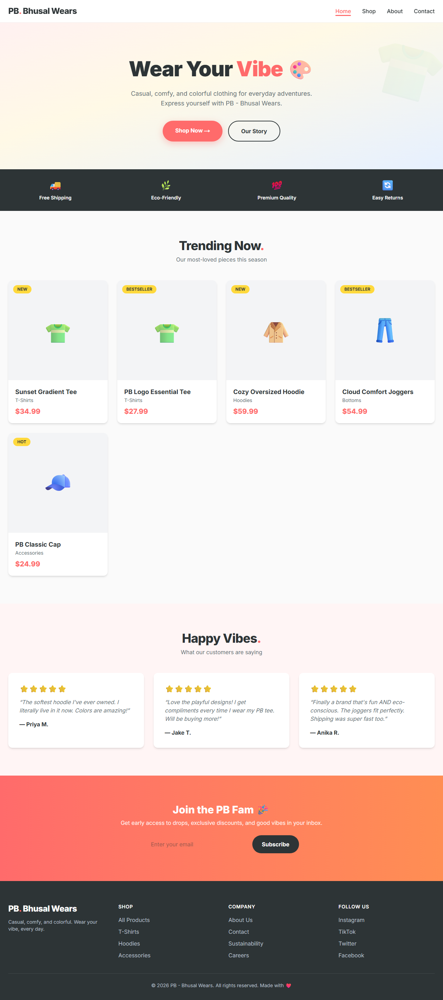
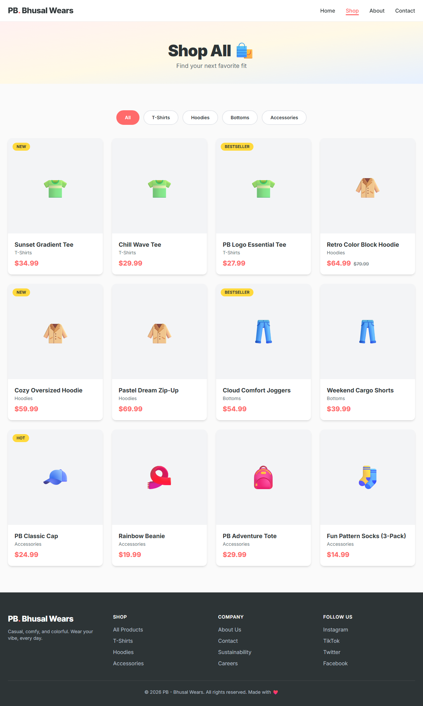
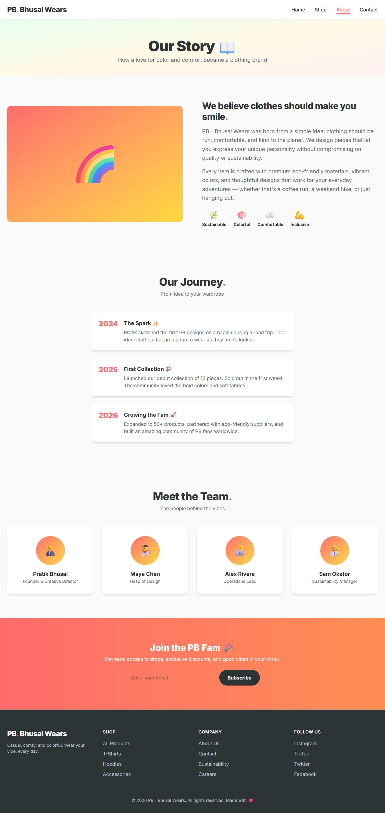
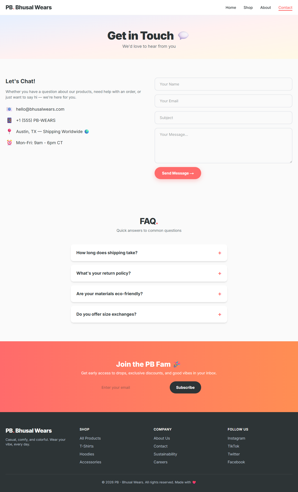
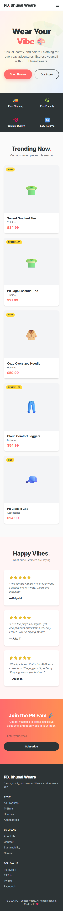

# PB. Bhusal Wears 🎨👕

A casual, colorful, and fun clothing company website built with **Next.js**, **React**, **TypeScript**, and **Tailwind CSS**. Full-stack ready architecture with component-based design, product data layer, and automated deployment.


🌐 **Live Site:** [pratikbhusal18.github.io/pb-bhusal-wears](https://pratikbhusal18.github.io/pb-bhusal-wears/)

---

## Screenshots

### 🏠 Home Page
Hero banner with gradient background, featured products, customer testimonials, and newsletter signup.



### 🛍️ Shop Page
Full product catalog with interactive category filters (T-Shirts, Hoodies, Bottoms, Accessories).



### 📖 About Page
Brand story, company timeline, core values, and team section.



### 💬 Contact Page
Contact form with validation, business details, and interactive FAQ accordion.



### 📱 Mobile View
Fully responsive design with hamburger navigation and stacked layouts.

<p align="center">
  
</p>

---

## Overview

PB - Bhusal Wears is an e-commerce storefront for a clothing brand that celebrates self-expression through casual, comfortable, and eco-friendly fashion. Built with a modern React architecture, it's designed to scale into a full-stack application with database, shopping cart, and payment integration.

### Pages

| Page | Route | Description |
|------|-------|-------------|
| **Home** | `/` | Hero banner, feature strip, trending products, testimonials, newsletter |
| **Shop** | `/shop` | Product catalog with real-time category filtering |
| **About** | `/about` | Brand story, timeline, values, team cards |
| **Contact** | `/contact` | Contact form, business info, FAQ accordion |

### Features

- 🎨 Casual & fun design with a playful color palette (coral, yellow, teal, sky blue)
- 📱 Fully responsive — mobile, tablet, and desktop
- ⚛️ React components with TypeScript for type safety
- 🛍️ Product data layer ready for database integration
- 🎯 Interactive category filtering on Shop page
- 📬 Newsletter and contact form with state management
- 🧭 App Router with sticky navbar and active page indicators
- 🚀 Static export for fast GitHub Pages deployment

---

## Tech Stack

| Technology | Purpose |
|------------|---------|
| **Next.js 16** | React framework with App Router and static export |
| **React 19** | Component-based UI |
| **TypeScript** | Type safety |
| **Tailwind CSS 4** | Utility-first styling |
| **GitHub Actions** | CI/CD pipeline |
| **GitHub Pages** | Hosting |

---

## Project Structure

```
pb-bhusal-wears/
├── .github/workflows/
│   └── deploy.yml              # GitHub Pages CI/CD
├── public/
│   └── screenshots/            # README screenshots
├── src/
│   ├── app/
│   │   ├── layout.tsx          # Root layout (Navbar + Footer)
│   │   ├── page.tsx            # Home page
│   │   ├── globals.css         # Tailwind + custom theme
│   │   ├── shop/page.tsx       # Shop page
│   │   ├── about/page.tsx      # About page
│   │   └── contact/page.tsx    # Contact page
│   ├── components/
│   │   ├── Navbar.tsx          # Sticky nav with mobile menu
│   │   ├── Footer.tsx          # Site footer
│   │   ├── ProductCard.tsx     # Reusable product card
│   │   └── Newsletter.tsx      # Email signup form
│   └── data/
│       └── products.ts         # Product catalog data
├── next.config.ts              # Next.js config (static export)
├── package.json
└── README.md
```

---

## Prerequisites

- [Node.js](https://nodejs.org/) 18+ and npm
- [Git](https://git-scm.com/)

---

## Setup Instructions

### 1. Clone the repository

```bash
git clone https://github.com/pratikbhusal18/pb-bhusal-wears.git
cd pb-bhusal-wears
```

### 2. Install dependencies

```bash
npm install
```

### 3. Run the development server

```bash
npm run dev
```

Visit [http://localhost:3000/pb-bhusal-wears](http://localhost:3000/pb-bhusal-wears)

### 4. Build for production

```bash
npm run build
```

Static files are exported to the `out/` directory.

---

## Deployment

The site auto-deploys to **GitHub Pages** on every push to the `master` branch via the workflow in `.github/workflows/deploy.yml`.

**How it works:**
1. GitHub Actions installs dependencies and runs `npm run build`
2. Next.js exports static HTML/CSS/JS to `out/`
3. The `out/` folder is deployed to GitHub Pages

To deploy manually:

```bash
git add -A
git commit -m "Your commit message"
git push origin master
```

The site updates at [pratikbhusal18.github.io/pb-bhusal-wears](https://pratikbhusal18.github.io/pb-bhusal-wears/) within ~2 minutes.

---

## Customization Guide

| What | Where |
|------|-------|
| Brand colors | `src/app/globals.css` → `@theme inline` block |
| Products | `src/data/products.ts` |
| Company info | `src/app/about/page.tsx` |
| Contact details | `src/app/contact/page.tsx` |
| Navigation links | `src/components/Navbar.tsx` |
| Footer links | `src/components/Footer.tsx` |

### Adding a new product

Add an entry to `src/data/products.ts`:

```typescript
{
  id: "13",
  name: "Your Product Name",
  category: "tshirts",
  categoryLabel: "T-Shirts",
  price: 29.99,
  emoji: "👕",
  badge: "NEW",
}
```

---

## Roadmap

- [ ] **Prisma + SQLite** — Move products to a database
- [ ] **Shopping cart** — React context with add/remove/quantity
- [ ] **Stripe checkout** — Real payment processing
- [ ] **User auth** — NextAuth.js with login & order history
- [ ] **Admin dashboard** — Manage products and orders
- [ ] **Product detail pages** — Individual product views
- [ ] **Search & filters** — Full-text search, price/size filtering
- [ ] **Dark mode** — Theme toggle
- [ ] **Real product images** — Replace emoji placeholders

---

## License

This project is open source under the [MIT License](LICENSE).

---

<p align="center">Made with ❤️ by <strong>PB - Bhusal Wears</strong></p>
